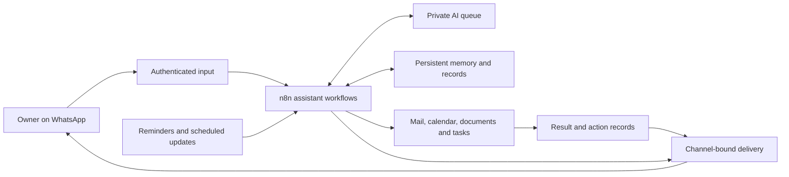

<h1 align="center">Prometheus</h1>

A private AI assistant for your conversations, information and everyday work.

<strong>One familiar chat. Connected personal tools. Actions under your control.</strong>

Prometheus brings email, calendars, documents, tasks, reminders and persistent memory into a single assistant, with **WhatsApp as its main chat**. Ask a question, send a voice message, share a document or request an action. Prometheus uses the connected tools, records the result and responds in the conversation.

The assistant runs on a self-hosted server. Your computer does not need to stay open for enabled workflows to process requests or scheduled updates. Delivery still depends on the connected services, messaging rules and the assistant being enabled.

> **Status — October 2026:** Complete for the accepted personal-assistant configuration, with owner tests and an isolated recovery check completed. Optional paid WhatsApp notifications are **OFF**. This is a **public project showcase of a private, proprietary implementation**. No application, source code, workflow exports or downloadable release is offered here.

## What Prometheus can do

| Capability | What it gives the owner |
| --- | --- |
| **Conversation and writing** | Discuss ideas, explain concepts, draft text and work through decisions from a familiar chat. |
| **Tasks and subtasks** | Create, list and update tasks; complete a specific subtask and verify the remaining statuses. |
| **Reminders** | Schedule one-time, daily or weekly reminders with timezone-aware delivery and persistent records. |
| **Google Calendar** | Read, create and reschedule personal events, targeting the existing event when an update is requested. |
| **Zoho email** | Search and read mail; prepare drafts; send or reply after confirmation; manage labels, folders, read status and supported moves. |
| **Google Docs and Drive** | Create, read and edit documents; find files; create folders; move the original file; send an exact file to recoverable Trash after confirmation. |
| **Voice, images and documents** | Transcribe voice locally; describe images; read supported documents and PDFs; answer later questions from the saved reading. |
| **Notes and conversation memory** | Save useful information, retrieve it by keywords or meaning, and recall bounded summaries of earlier conversations. |
| **Web research and Wikipedia** | Find relevant public sources, return links and explain findings within explicit research budgets. |
| **Focused AI workers** | Route requested writing, planning or deeper reasoning to bounded specialist workers. |
| **Personal settings** | Save owner profile and response preferences, plus permitted check-in settings. |
| **Proactive updates** | Deliver requested reminders, new-email notices and changes to the pending parent-task list, within delivery and frequency controls. |

See the [full capability guide](docs/CAPABILITIES.md) for supported operations, formats and limits.

## What using it looks like

These are illustrative requests, not messages to a publicly available bot.

| Request | Expected workflow |
| --- | --- |
| “Move my planning meeting to 10:30. Update the existing event.” | Identify and update the same calendar event, then report the result. |
| “Complete only ‘Review notes’ under my presentation task.” | Change that subtask and read back the parent and sibling statuses. |
| “Prepare an email with this text. Show me before sending.” | Produce a recipient/content preview and a separate, expiring confirmation command. |
| “Which languages did the document I sent list?” | Use the saved document reading to answer the follow-up. |
| “What did we decide about that project earlier?” | Retrieve relevant saved notes or conversation summaries. |

An error in the final reply does not necessarily mean that the preceding action failed. Prometheus checks saved state before repeating a consequential action.

## How it works

Self-hosted **n8n** workflows coordinate messaging, tool access, AI work and persistent state. A private AI queue supplies reasoning; connected services perform permitted operations; durable records support verification and recovery.

The current private implementation includes **188 main-workflow nodes and 17 recursively referenced helper workflows**, including error handling. These describe the implementation's scope, not its throughput or a promise of unlimited concurrency.

Read the [architecture guide](docs/ARCHITECTURE.md) for the responsibilities of each layer.

## Control, privacy and reliability

- **Paired-owner access:** the personal deployment accepts authorized owner requests, rather than serving public visitors or multiple customers.
- **Explicit confirmation:** sending email and supported Trash operations require an exact preview followed by a separate, expiring typed confirmation.
- **Untrusted content stays informational:** emails, documents and web results cannot grant permissions. Attachment-reading turns have no action tools.
- **Bounded work:** queues, tool iterations, attachments and research requests have limits.
- **Recorded attempts:** protected actions and notifications keep attempt and acknowledgment records; uncertain delivery is held for review instead of blindly resent.
- **No automatic paid AI fallback:** a failed AI request does not silently switch providers. An explicitly requested paid route is a separate choice.
- **Owner stop control:** stopping the assistant prevents new work; an execution already running can still finish.
- **Recovery checks:** encrypted backups are supported by an actual isolated restore, including saved data and local processing components.

Self-hosting does not mean every request stays on the server. Configured AI, messaging, search, mail and document providers receive the information needed for their operations. Private execution history and backups can retain conversation or attachment content. This repository contains no private records, credentials or production deployment details.

Read [control and reliability](docs/CONTROL-AND-RELIABILITY.md) for confirmation behavior, failure handling and recovery boundaries.

## What has been verified

Owner tests covered WhatsApp text and voice, reminders, notes, task/subtask handling, calendar rescheduling, document editing and file organization, incoming-mail notices, task check-ins, image/PDF reading and a later document question.

The final completion work also included **64 notification/control checks** and **29 queue/reminder recovery checks**. The current isolated restore matched **26 native table fingerprints, 22 stored workflow definitions/versions and five SQLite ledgers**, with local voice, PDF and semantic processing checked. Earlier check suites overlap; these figures are not a cumulative count of distinct tests.

This establishes acceptance for the chosen personal configuration. It does not establish commercial multi-user readiness, uninterrupted uptime or successful operation for every input and provider account. See the [verification scope](docs/CONTROL-AND-RELIABILITY.md#verification-scope).

## Practical boundaries

**Optional paid WhatsApp notifications remain OFF.** When the messaging window closes, reminder and email notices can be deferred until the owner reopens it; task check-ins are reconsidered when eligible. Standalone approved-template delivery after a closed window has passed, but automatic paid delivery across all three notification routes has not been accepted or enabled.

Prometheus does not independently execute the task list, provide arbitrary shell/browser control or supervise an entire automation fleet. Meta Business Suite, Facebook/Instagram inboxes, comments, labels and orders are outside this personal-assistant scope. A separate marketing team and automation control centre are separate projects.

Provider usage, subscriptions and message allowances are separate costs. Disabling the optional paid-template route is not an account-wide billing cap. Read the [FAQ](docs/FAQ.md) for the current pricing boundary and what “OFF” means.

## Explore the project

| Guide | Contents |
| --- | --- |
| [Capabilities](docs/CAPABILITIES.md) | Tools, everyday examples, notifications, memory and supported inputs. |
| [Architecture](docs/ARCHITECTURE.md) | Messaging, orchestration, AI workers, storage and scheduling. |
| [Control and reliability](docs/CONTROL-AND-RELIABILITY.md) | Owner authority, confirmations, duplicates, failures, backups and acceptance evidence. |
| [FAQ](docs/FAQ.md) | Availability, costs, WhatsApp rules, limits and project scope. |

## Availability

This repository documents the project. It is not an installation package, hosted service or public bot. Implementation code, workflow exports, deployment instructions, credentials, personal records and recovery material remain private.

No public release, free distribution or launch date is announced. Any future availability would have separately stated terms; viewing this showcase does not grant access to the implementation.

## Author and Community

- Author: **KSAGlory**
- Community: [discord.gg/ksahub](https://discord.gg/ksahub)

## License

The Prometheus implementation remains private and proprietary. No application or source-code license is offered through this repository. Any future distribution would have separately stated terms. Third-party projects retain their respective rights and terms.

Copyright © 2026 KSAGlory. All rights reserved.
