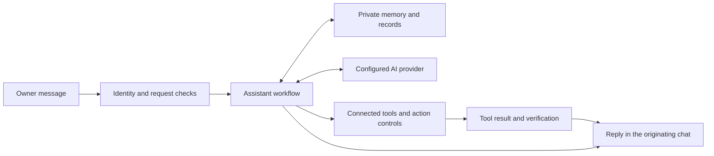

# Prometheus

An owner-controlled AI assistant for conversations, everyday tasks and connected tools.

Prometheus brings messaging, memory, reminders, email, documents and research into one assistant. It is being developed around a practical goal: ask for help in a familiar chat, review consequential actions before they happen, and keep useful information available for the next conversation.

> **Current status:** Private development with a working personal prototype. Core capabilities have passed owner tests in a private environment; external messaging and final system acceptance remain in progress. Prometheus is not available for public use or download. This repository is a project showcase, not a software release.

## What Prometheus can do

The current prototype has been exercised with the following capabilities:

| Area | Current behavior |
| --- | --- |
| Conversation | Private owner conversations through Telegram and WhatsApp, including text and voice input. |
| Memory | Saved notes, keyword and semantic retrieval, persistent conversation history and bounded summaries for earlier-conversation recall. |
| Tasks | Create and manage parent tasks and subtasks, with targeted completion and tool-based status checks. |
| Reminders | Schedule requested reminders and deliver them through the configured messaging channel when that channel permits delivery. |
| Calendar | Read, create and reschedule personal Google Calendar events, with verification of the existing event. |
| Email | Read and search connected mailboxes, prepare drafts, send or reply after confirmation, and notify the owner of new mail. |
| Documents | Create, read and edit Google Docs; organize Google Drive folders and files; move an exact file to recoverable Trash after confirmation. |
| Attachments | Describe images and summarize supported documents, including PDFs; answer follow-up questions from the saved reading. |
| Research | Search public web sources and look up Wikipedia articles, returning source links and stating uncertainty. |
| Focused assistance | Delegate requested writing, planning and complex reasoning to bounded worker agents. |
| Check-ins | Notify the owner when the pending task list changes, within configured frequency and quiet-hour limits. |

These are results from personal prototype testing, not guarantees for every account, input or deployment. An initial tool failure can leave a completed action behind; saved state is checked before an action is repeated.

## How it works

Prometheus uses self-hosted n8n workflows to coordinate messaging, connected tools and persistent records. AI assistance is supplied by a configured provider; the workflow system carries out permitted tool operations and records their results.

A request to move a calendar event updates the existing event. A request to complete one subtask targets that subtask. A request to send an email first produces a preview and a confirmation command. The aim is to make the scope of an action clear and its outcome verifiable.

## Control and privacy

- **Owner access:** the current deployment is restricted to its paired owner. It is not a public chatbot or a service shared by multiple customers.
- **Action approval:** email sending and supported recoverable Trash operations use a preview followed by separate confirmation tied to the requested action.
- **Untrusted content:** attachments, emails and search results are treated as information. Their contents cannot authorize an action; attachment-reading turns have no action tools.
- **Channel routing:** direct replies return through the originating chat. Background notices use their configured destination and respect channel restrictions.
- **Duplicate handling:** protected operations and notification delivery record attempts. Uncertain delivery is not automatically retried.
- **Explicit provider selection:** a failed AI request does not silently switch to a paid fallback provider.
- **An explicit stop control:** the owner can stop new assistant work and scheduled delivery. Work already in progress may still finish.
- **Persistent records:** notes, tasks and conversation records survive normal stop/start cycles. Encrypted backups and isolated recovery checks support restoration.

Self-hosting does not mean that every request stays on the host. Configured AI, messaging, search, mail and document services receive the information needed for their operations. Private execution history and retained backups can contain conversation or attachment content. This public repository contains no personal records, credentials, workflow exports or deployment configuration.

## Development priorities and limits

WhatsApp text, voice, attachment reading and ordinary reminder delivery have passed owner tests. Proactive WhatsApp notifications outside the customer-service window still require approved templates and a controlled delivery test; automatic paid template delivery is not connected.

Further work includes Facebook Page/Messenger and Instagram integration, a complete review of shared dependencies, final persistence and recovery acceptance, and updated operating documentation. These items are development work, not currently available integrations.

The current check-in reports changes to pending parent tasks. It does not independently execute the task list. Supervision of unrelated automation workflows is outside Prometheus's scope.

External services have their own account requirements, usage limits, pricing and policies. Provider approval and costs must be assessed for each intended deployment. A working personal prototype does not establish readiness for customer access or a public launch.

## Project foundation

Prometheus was adapted from [n8nClaw, an n8n workflow template by Shabbir Noor](https://n8n.io/workflows/13717-run-a-self-hosted-multi-channel-ai-assistant-with-claude-gemini-and-gmail/). The private adaptation adds owner-scoped controls, verified tool operations, persistent records and bounded channel delivery. The original template is credited as the foundation rather than presented as work authored entirely from scratch.

n8n, messaging platforms, connected services and the original template are separate projects with their own terms. No third-party source or workflow package is distributed through this repository.

## Availability

There is no public release package, hosted assistant access or launch date to announce yet. This repository contains reviewed project information only. The application source, live workflows, operating infrastructure and personal test records remain private.

## Author and Community

- Author: **KSAGlory**
- Community: [discord.gg/ksahub](https://discord.gg/ksahub)

## License

No application or source-code license is offered through this repository. Release terms will be stated when a public version is available. Third-party projects retain their respective rights and terms.

Copyright © 2026 KSAGlory. All rights reserved.
